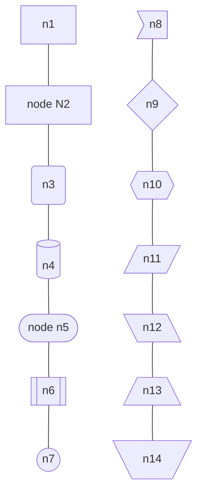
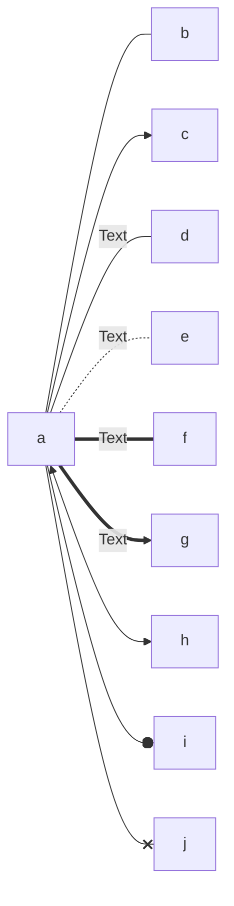
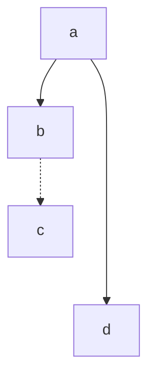
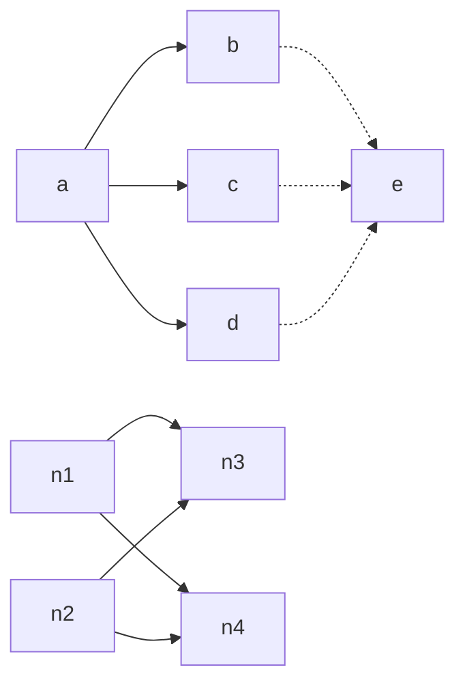
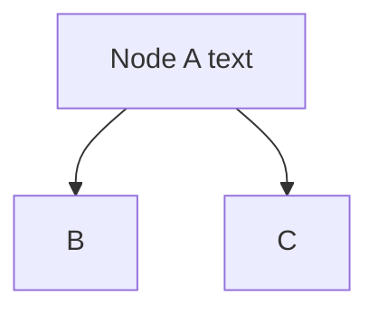
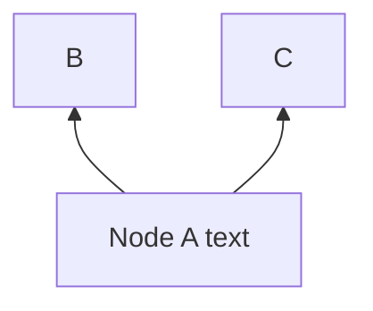
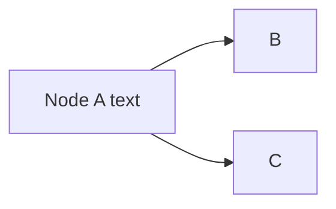
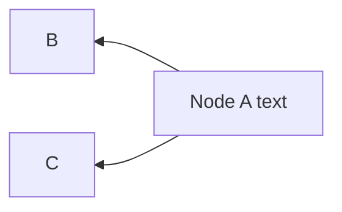
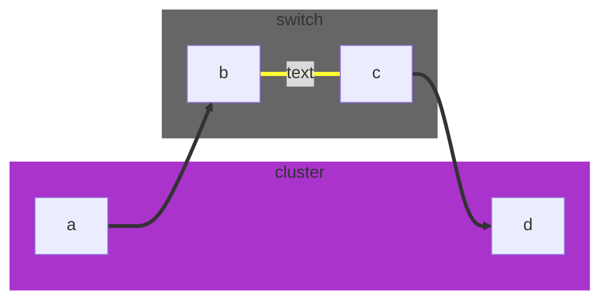

# Mermaid

[Mermaid](https://mermaid-js.github.io/) is a code-based UML diagram generator with markdown support on [popular platforms](https://mermaid-js.github.io/mermaid/#/./integrations) like GitLab, Azure DevOps and many others.

## Table of Contents

- [Mermaid](#mermaid)
  - [Table of Contents](#table-of-contents)
  - [Graph](#graph)
    - [Node shapes](#node-shapes)
  - [Flowchart](#flowchart)
    - [Link between nodes](#link-between-nodes)
    - [Orientation](#orientation)
    - [Subgraphs](#subgraphs)

## Graph

### Node shapes

## Flowchart

### Link between nodes

Link types:

Longer links:

| Length            | 1    | 2     | 3      |
| ----------------- | ---- | ----- | ------ |
| Normal            | ---  | ----  | -----  |
| Normal with arrow | -->  | --->  | ---->  |
| Thick             | ===  | ====  | =====  |
| Thick with arrow  | ==>  | ===>  | ====>  |
| Dotted            | -.-  | -..-  | -...-  |
| Dotted with arrow | -.-> | -..-> | -...-> |

Multiple links:

### Orientation

Top Bottom:

Bottom Top:

Left Right:

Right Left:

### Subgraphs

